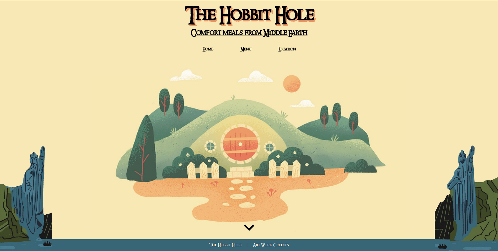

# The Hobbit Hole

Welcome to **The Hobbit Hole!** A fictional fantasy restaurant website set in Middle-Earth.
Here you will find my appreciation for the love of food Hobbits have within Tolkien's universe.
So get ready to fill your belly within the cozy homestead of the shire,
but be sure to make a reservation, for parties of dwarves have been known to fill the restaurant without announcement!

## Features

- Interactive DOM
- Extensive menu items
- Reservation form

## What I learned from the Project

- Gained experience in **ES6 Modules** for better code organization.
- Learned how to use **npm** for efficient package management.
- Gained experience with **Webpack** for bundling resources effectively.

## Live Preview

Click [here](https://zukurai-kushal.github.io/restaurant-page/) to view the live page.
